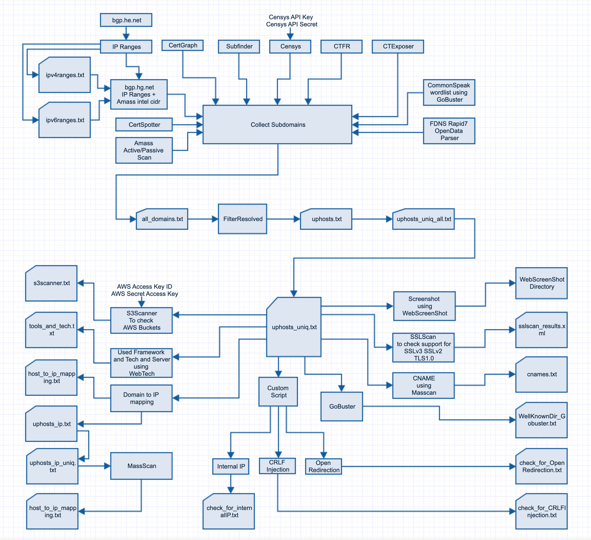

# DomainRecon
Find all the information for specific domain

Based on URL and Organization Name, collect the IP Ranges, subdomains using various tools like Amass, subfinder, etc.. And check for uphost and Run Masscan to grap CNAME entries, take the screenshot of all the found subdomains using WebScreeShot and more...

Review below screenshot for details description..

<br /> <br />

# Installation 
Following command used to run installscript (Take sometime to configure)
```
chmod 777 installscript
./installscript
```

# Configuration 
- To Configure Censys 
  - Repalce Key and ID in installscript and GlobalVariables.py files
- To Configure aws key and secret (for S3Scanner)
  ```
  aws configure
  ```
| WARNING: This was tested in stand alone Ubuntu 18.04 Virtual Machine. |
| --- |
